# 커넥쇼

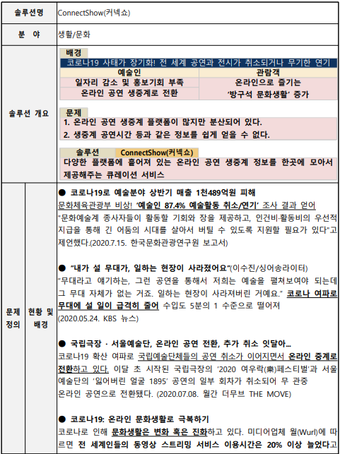

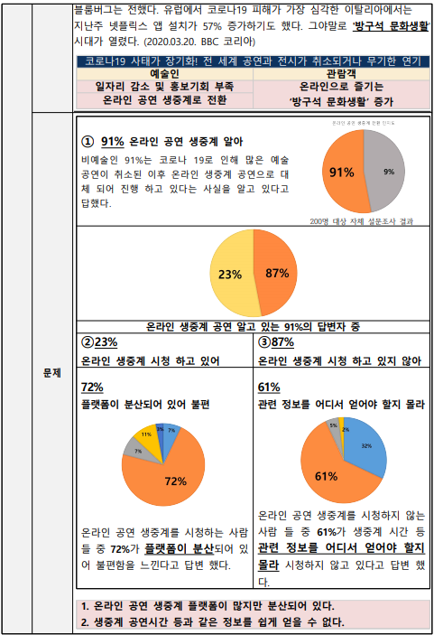

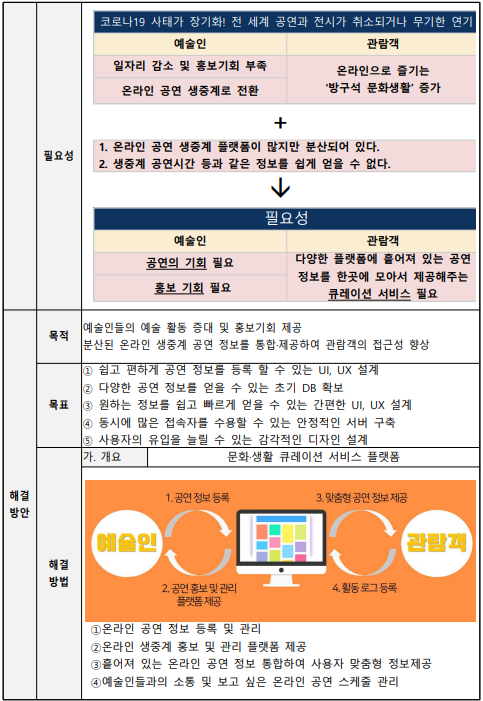

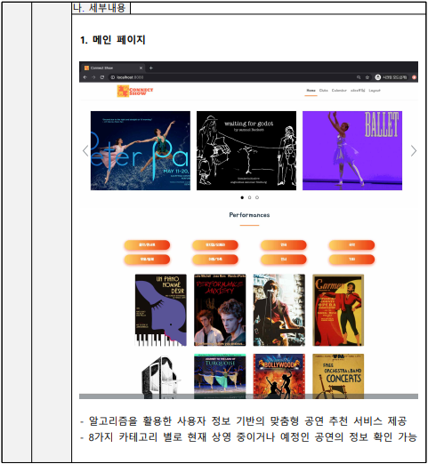

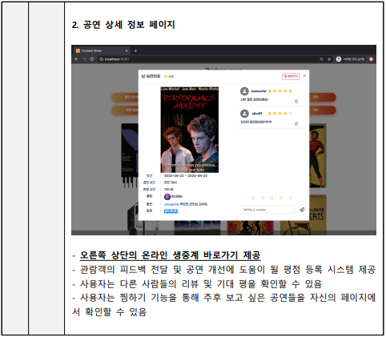

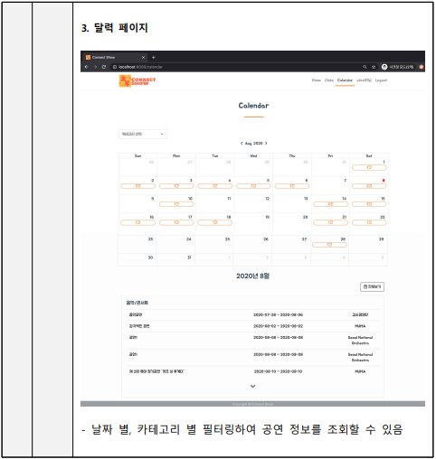

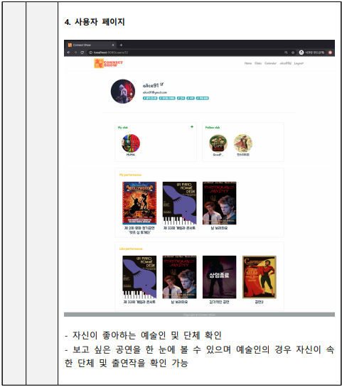

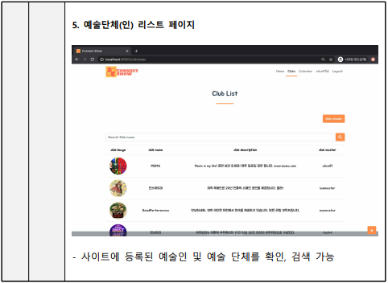

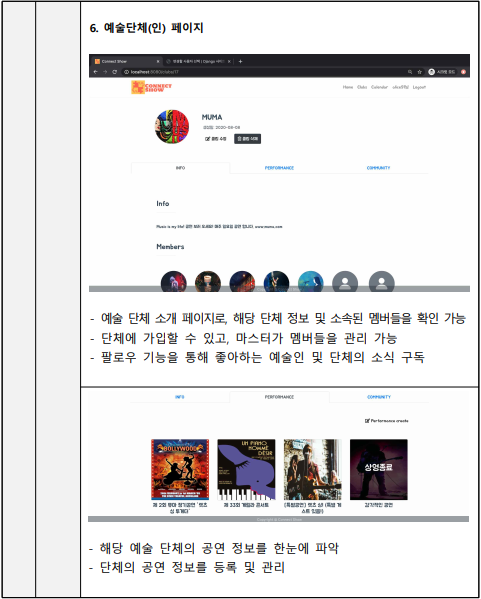

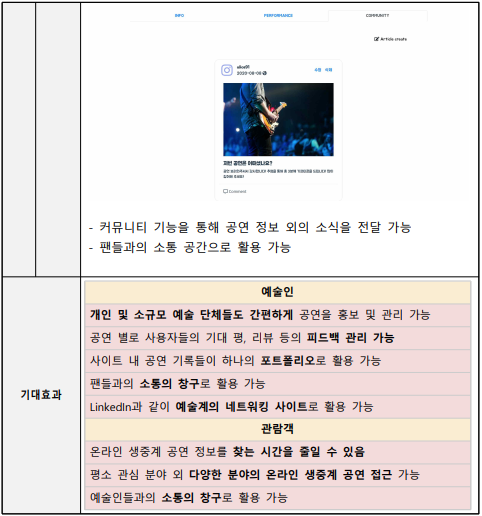


# Start

```bash
pip install -r requirements.txt
python manage.py runserver
```


# API

| 기능          | HTTP Methods | Url                  | Input Parameter                                              | Response           |
| ------------- | ------------ | -------------------- | ------------------------------------------------------------ | ------------------ |
| 회원가입      | post         | /rest-auth/signup/   | username, passward1, passward2 ,email, like_category, profile_image(default) | status, data(user) |
| 로그인        | post         | /rest-auth/login/    | username, passward                                           | token              |
| 로그아웃      | post         | /rest-auth/logout/   | token(header)                                                | status             |
| 회원정보 수정 | put          | /accounts/<user_id>/ | email, like_category, profile_image(default)                 | status, data(user) |
| 회원 탈퇴     | delete       | /accounts/<user_id>/ | token(header)                                                | status             |

...

# ERD

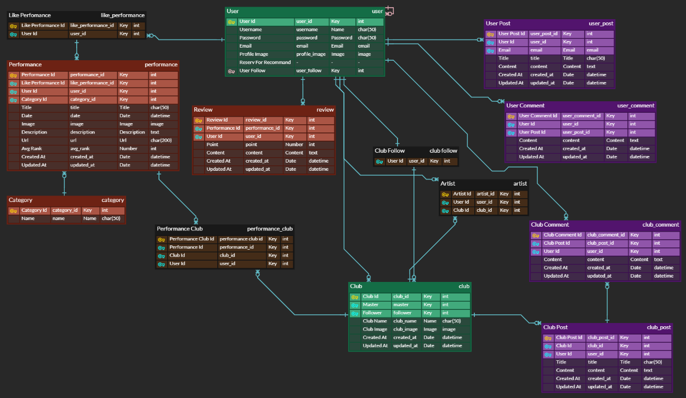